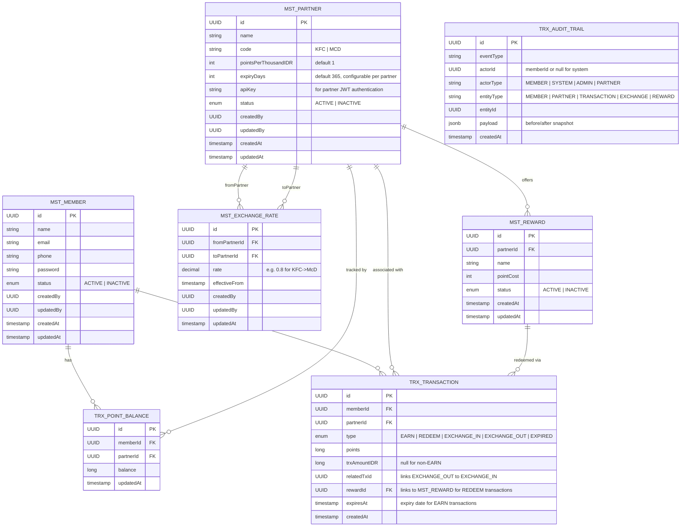
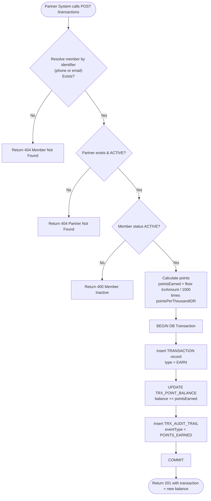
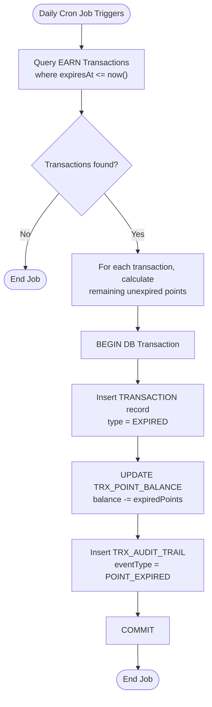
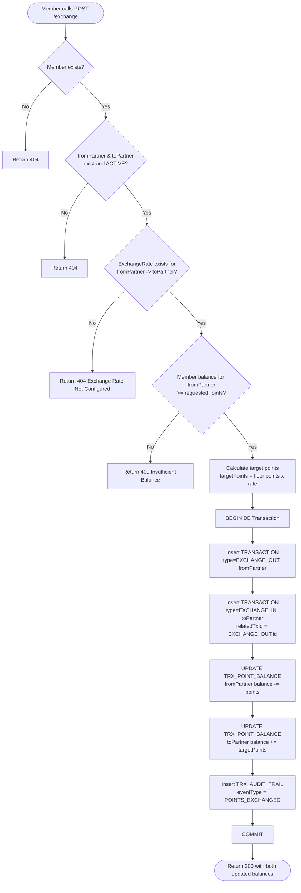

# Technical Specification Document (TSD)
## JDT-17-LOYALTY — Loyalty Points Platform
**Version:** 1.0  
**Date:** 2 July 2026  
**Deadline:** 14 July 2026  
**Author:** Technical Architect (AI-assisted)  
**References:** FSD.md, README.md

---

## 1. Proposed Tech Stack

| Layer | Technology | Justification |
|-------|-----------|---------------|
| **Language** | Java 21 (LTS) | Aligns with bootcamp context (project is under `java/` path); strong typing aids correctness; virtual threads (Project Loom) available for free concurrency gains |
| **Framework** | Spring Boot 4.1.x | Latest stable generation; built on Spring Framework 7; native Jakarta EE 11 support; requires Java 21 minimum |
| **ORM** | Spring Data JPA + Hibernate | Handles DB mapping, transactions, and query generation with minimal SQL boilerplate |
| **Database** | PostgreSQL 18 | Latest stable release; improved vacuum, logical replication, and query planner; ACID transactions essential for point balance integrity; free and widely available |
| **DB Migration** | Flyway | Version-controlled schema migrations; easy to seed initial data (partners, rewards, exchange rates) |
| **Build Tool** | Maven | Standard for Spring Boot; familiar to most Java developers |
| **Testing** | JUnit 5 + Mockito | Standard Java testing stack; Mockito enables service-layer unit testing without DB |
| **API Docs** | SpringDoc OpenAPI (Swagger UI) | Auto-generates interactive API docs from annotations; useful for demo |
| **Frontend** | Next.js 16 + React 19 + TypeScript | Mobile-first web UI; App Router architecture; TypeScript for type safety; shadcn/ui components + Tailwind CSS for styling |
| **Containerization** | Docker + Docker Compose | One-command local setup (`docker compose up`); eliminates "works on my machine" issues |

> **Why not Node.js / Python?** The project lives in a `java/` directory and the bootcamp context implies Java. Spring Boot is well-suited for 2-week delivery — abundant scaffolding tools (`spring initializr`), mature testing support, and straightforward REST + JPA patterns.
> **Why Spring Boot 4.1.x over 3.x?** Spring Boot 4 drops legacy `javax.*` baggage entirely, ships with better virtual-thread integration (Java 21 Loom), and is the current recommended baseline as of mid-2026. Minimum Java version aligns with Java 21 LTS.

---

## 2. Entity Relationship Diagram (ERD)



### Key Design Decisions

- **`TRX_POINT_BALANCE`** is a dedicated balance table (not computed from transaction sum on every read) — faster reads, simpler balance check logic. Balance is updated atomically with each transaction within a DB transaction.
- **`pointsPerThousandIDR`** on `MST_PARTNER` is the configurable accumulation rate.
- **`expiryDays`** on `MST_PARTNER` is the configurable expiry duration per partner (default 365 days). Expiry date is computed at EARN time: `expiresAt = now + partner.expiryDays days`.
- **`MST_EXCHANGE_RATE`** stores directional rates: one row for KFC→McD, another for McD→KFC. This allows asymmetric rates.
- **`MST_REWARD`** stores partner reward catalog. `pointCost` is validated against member balance at redemption time. No stock management in MVP.
- **`TRX_TRANSACTION.type = EXPIRED`** is recorded as a transaction row for member-visible history. Members can see why their balance decreased.
- **`TRX_TRANSACTION.rewardId`** links REDEEM transactions to the specific reward item redeemed.
- **`TRX_AUDIT_TRAIL.payload`** stores a JSON snapshot for event reconstruction without joining other tables.
- **`apiKey`** on `MST_PARTNER` is validated on `POST /auth/partner/token` to issue a partner-scoped JWT.

---

## 3. Flowcharts

### 3.1 Point Accumulation Flow



### 3.2 Point Expiry Job Flow



### 3.3 Point Exchange Flow



---

## 4. API Specification

### Conventions

- **Base URL:** `http://localhost:8080/api/v1`
- **Content-Type:** `application/json`
- **Auth:** Secured endpoints require header: `Authorization: Bearer <JWT>`. JWT contains role claim (MEMBER | ADMIN | PARTNER).
- **Error response format** (all errors):
  ```json
  {
    "status": 400,
    "error": "BAD_REQUEST",
    "message": "Insufficient point balance"
  }
  ```

---

## 4.0 Authentication Endpoints

### 4.0.1 POST /auth/register

**Description:** Register a new member and return JWT + member object (auto-login).

**Authorization:** Public (no JWT required)

**Request Body:**
```json
{
  "name": "Budi Santoso",
  "email": "budi@example.com",
  "phone": "081234567890",
  "password": "securePassword123"
}
```

**Response 201:**
```json
{
  "token": "eyJhbGciOiJIUzI1NiIsInR5cCI6IkpXVCJ9...",
  "member": {
    "id": "550e8400-e29b-41d4-a716-446655440001",
    "name": "Budi Santoso",
    "email": "budi@example.com",
    "phone": "081234567890",
    "status": "ACTIVE",
    "createdAt": "2026-07-03T10:00:00Z"
  }
}
```

**Notes:**
- Member balances are auto-initialized to 0 for all active partners.
- JWT includes role claim = `MEMBER`.

---

### 4.0.2 POST /auth/login

**Description:** Login for Member or Admin. System checks both repositories.

**Authorization:** Public (no JWT required)

**Request Body:**
```json
{
  "email": "budi@example.com",
  "password": "securePassword123"
}
```

**Response 200:**
```json
{
  "token": "eyJhbGciOiJIUzI1NiIsInR5cCI6IkpXVCJ9...",
  "role": "MEMBER",
  "user": {
    "id": "550e8400-e29b-41d4-a716-446655440001",
    "name": "Budi Santoso",
    "email": "budi@example.com",
    "phone": "081234567890",
    "status": "ACTIVE"
  }
}
```

**Response 401:**
```json
{
  "status": 401,
  "error": "UNAUTHORIZED",
  "message": "Invalid email or password"
}
```

**Notes:**
- JWT includes role claim = `MEMBER` or `ADMIN`.
- Frontend uses role to route user to correct UI (member app vs admin CMS).

---

### 4.0.3 POST /auth/partner/token

**Description:** Generate JWT for partner API calls. Validates apiKey against MST_PARTNER table.

**Authorization:** Public (no JWT required)

**Request Body:**
```json
{
  "partnerId": "kfc-uuid",
  "apiKey": "kfc-api-key-demo"
}
```

**Response 200:**
```json
{
  "token": "eyJhbGciOiJIUzI1NiIsInR5cCI6IkpXVCJ9...",
  "expiresIn": 3600
}
```

**Response 401:**
```json
{
  "status": 401,
  "error": "UNAUTHORIZED",
  "message": "Invalid partner credentials"
}
```

**Notes:**
- JWT includes role claim = `PARTNER`.
- Partner system includes this JWT in subsequent API calls (POST /transactions).

---

### 4.1 ~~POST /members~~ — Member Registration (DEPRECATED)

**Note:** Member registration is now handled by `POST /auth/register` (see §4.0.1). This endpoint returns both a JWT token and the member object, enabling immediate login after registration.

**Migration:** Replace calls to `POST /members` with `POST /auth/register`. The new endpoint auto-initializes point balances for all active partners and returns a JWT for immediate authentication.

---

### 4.2 `GET /members` — List Members

**Description:** List all members. Supports optional `?status=ACTIVE|INACTIVE`.  
**Auth:** Bearer JWT (Role: ADMIN)

**Response `200 OK`:**
```json
{
  "data": [
    {
      "id": "550e8400-e29b-41d4-a716-446655440001",
      "name": "Budi Santoso",
      "email": "budi@example.com",
      "status": "ACTIVE",
      "createdAt": "2026-07-02T10:00:00Z"
    }
  ],
  "total": 1
}
```

**Status Codes:** `200`, `401` (missing/invalid JWT), `403` (insufficient role)

---

### 4.3 `GET /members/{id}` — Get Member Detail

**Description:** Get a single member's profile.  
**Auth:** None

**Response `200 OK`:**
```json
{
  "id": "550e8400-e29b-41d4-a716-446655440001",
  "name": "Budi Santoso",
  "email": "budi@example.com",
  "phone": "081234567890",
  "status": "ACTIVE",
  "createdAt": "2026-07-02T10:00:00Z"
}
```

**Status Codes:** `200`, `404` (member not found)

---

### 4.4 `PUT /members/{id}` — Edit Member (CMS)

**Description:** Update member details or status.  
**Auth:** Bearer JWT (Role: ADMIN)

**Request:**
```json
{
  "name": "Budi S.",
  "phone": "089876543210",
  "status": "INACTIVE"
}
```

**Response `200 OK`:** Updated member object (same shape as 4.3).  
**Status Codes:** `200`, `401`, `404`

---

### 4.5 `GET /members/{id}/points` — Get Point Balances

**Description:** Get a member's point balances across all partners.  
**Auth:** None

**Response `200 OK`:**
```json
{
  "memberId": "550e8400-e29b-41d4-a716-446655440001",
  "memberName": "Budi Santoso",
  "balances": [
    { "partnerId": "kfc-uuid", "partnerName": "KFC", "balance": 350 },
    { "partnerId": "mcd-uuid", "partnerName": "McDonald's", "balance": 120 }
  ]
}
```

**Status Codes:** `200`, `404`

---

### 4.6 `GET /members/{id}/transactions` — Get Transaction History

**Description:** Paginated transaction history for a member.  
**Query Params:** `?page=0&size=10&type=EARN|REDEEM|EXCHANGE_IN|EXCHANGE_OUT`  
**Auth:** None

**Response `200 OK`:**
```json
{
  "memberId": "550e8400-e29b-41d4-a716-446655440001",
  "page": 0,
  "size": 10,
  "total": 2,
  "transactions": [
    {
      "id": "tx-uuid-001",
      "type": "EARN",
      "partnerId": "kfc-uuid",
      "partnerName": "KFC",
      "points": 150,
      "trxAmountIDR": 150000,
      "createdAt": "2026-07-02T10:05:00Z"
    },
    {
      "id": "tx-uuid-002",
      "type": "EXCHANGE_OUT",
      "partnerId": "kfc-uuid",
      "partnerName": "KFC",
      "points": -100,
      "relatedTxId": "tx-uuid-003",
      "createdAt": "2026-07-02T10:10:00Z"
    }
  ]
}
```

**Status Codes:** `200`, `404`

---

### 4.7 `POST /transactions` — Simulate Partner Transaction (Point Earn)

**Description:** Simulates a partner sending a transaction to earn points for a member.  
**Auth:** None (simulated partner call; no API key in MVP — see FSD §7.6)

**Request:**
```json
{
  "memberIdentifier": "081234567890",
  "partner": "KFC",
  "trxAmount": 150000
}
```

**Response `201 Created`:**
```json
{
  "transactionId": "tx-uuid-001",
  "memberId": "550e8400-e29b-41d4-a716-446655440001",
  "partner": "KFC",
  "trxAmountIDR": 150000,
  "pointsEarned": 150,
  "newBalance": 350,
  "createdAt": "2026-07-02T10:05:00Z"
}
```

**Status Codes:** `201`, `400` (member inactive), `404` (member or partner not found)

---

### 4.8 `GET /partners` — List Partners

**Description:** List all registered partners.  
**Auth:** Bearer JWT (Role: ADMIN or MEMBER)

**Response `200 OK`:**
```json
{
  "data": [
    {
      "id": "kfc-uuid",
      "name": "KFC",
      "code": "KFC",
      "pointsPerThousandIDR": 1,
      "status": "ACTIVE"
    },
    {
      "id": "mcd-uuid",
      "name": "McDonald's",
      "code": "MCD",
      "pointsPerThousandIDR": 1,
      "status": "ACTIVE"
    }
  ]
}
```

### 4.9 `POST /partners` — Create Partner

**Description:** Add a new partner to the system. Existing members will automatically have a 0 balance initialized for this new partner.
**Auth:** Bearer JWT (Role: ADMIN)

**Request:**
```json
{
  "name": "Starbucks",
  "code": "SBUX",
  "pointsPerThousandIDR": 2
}
```

**Response `201 Created`:**
```json
{
  "id": "sbux-uuid",
  "name": "Starbucks",
  "code": "SBUX",
  "pointsPerThousandIDR": 2,
  "status": "ACTIVE",
  "createdAt": "2026-07-03T10:00:00Z"
}
```

**Status Codes:** `201`, `401` (missing/invalid JWT), `403` (insufficient role)

---


### 4.10 `POST /exchange` — Exchange Points Between Partners

**Description:** Convert a member's points from one partner to another at the configured rate.  
**Auth:** Bearer JWT (Role: MEMBER)

**Request:**
```json
{
  "memberId": "550e8400-e29b-41d4-a716-446655440001",
  "fromPartnerId": "kfc-uuid",
  "toPartnerId": "mcd-uuid",
  "points": 100
}
```

**Response `200 OK`:**
```json
{
  "memberId": "550e8400-e29b-41d4-a716-446655440001",
  "fromPartner": "KFC",
  "toPartner": "McDonald's",
  "pointsDeducted": 100,
  "pointsCredited": 80,
  "exchangeRate": 0.8,
  "updatedBalances": {
    "KFC": 250,
    "McDonald's": 200
  },
  "outTransactionId": "tx-uuid-004",
  "inTransactionId": "tx-uuid-005",
  "exchangedAt": "2026-07-02T11:15:00Z"
}
```

**Status Codes:** `200`, `400` (insufficient balance), `404` (member, partner, or exchange rate not found)

---

### 4.11 `GET /rewards` — List Available Rewards

**Description:** List all active rewards. Optional filter by partnerId.  
**Auth:** Bearer JWT (any authenticated user)

**Query Params:**
- `partnerId` (optional): Filter rewards by partner UUID

**Response `200 OK`:**
```json
{
  "data": [
    {
      "id": "reward-uuid-001",
      "partnerId": "kfc-uuid",
      "partnerName": "KFC",
      "name": "KFC Original Bucket (4 pcs)",
      "pointCost": 500,
      "status": "ACTIVE",
      "createdAt": "2026-07-01T00:00:00Z"
    },
    {
      "id": "reward-uuid-002",
      "partnerId": "kfc-uuid",
      "partnerName": "KFC",
      "name": "KFC Zinger Burger",
      "pointCost": 200,
      "status": "ACTIVE",
      "createdAt": "2026-07-01T00:00:00Z"
    }
  ],
  "total": 2
}
```

**Status Codes:** `200`, `401` (missing/invalid JWT)

---

### 4.12 `POST /redeem` — Redeem Points for Reward

**Description:** Redeem a reward using member's points. Validates balance, deducts points, creates REDEEM transaction.  
**Auth:** Bearer JWT (Role: MEMBER or ADMIN)

**Request:**
```json
{
  "memberId": "550e8400-e29b-41d4-a716-446655440001",
  "rewardId": "reward-uuid-001"
}
```

**Response `200 OK`:**
```json
{
  "transactionId": "tx-uuid-006",
  "rewardName": "KFC Original Bucket (4 pcs)",
  "partnerId": "kfc-uuid",
  "partnerName": "KFC",
  "pointsDeducted": 500,
  "newBalance": 0,
  "redeemedAt": "2026-07-03T10:00:00Z"
}
```

**Response `422 Unprocessable Entity`:**
```json
{
  "status": 422,
  "error": "UNPROCESSABLE_ENTITY",
  "message": "Insufficient points. Required: 500, Available: 300"
}
```

**Status Codes:** `200`, `400` (inactive member), `404` (member or reward not found), `422` (insufficient balance)

---

## 5. Audit Trail Design

### 5.1 Purpose

Every significant state-changing action is logged in the `AUDIT_TRAIL` table. This provides a tamper-evident history of member activity and admin operations without modifying business tables.

### 5.2 Events Logged

| Event Type | Trigger | Actor Type |
|------------|---------|-----------| 
| `MEMBER_REGISTERED` | `POST /auth/register` | SYSTEM |
| `MEMBER_UPDATED` | `PUT /members/{id}` | ADMIN |
| `MEMBER_STATUS_CHANGED` | Status toggle via `PUT /members/{id}` | ADMIN |
| `PARTNER_CREATED` | `POST /partners` | ADMIN |
| `POINTS_EARNED` | `POST /transactions` | SYSTEM |
| `POINT_EXPIRED` | Expiry Cron Job | SYSTEM |
| `POINTS_EXCHANGED` | `POST /exchange` | MEMBER |
| `POINTS_REDEEMED` | `POST /redeem` | MEMBER |

### 5.3 Audit Trail Schema

```sql
CREATE TABLE trx_audit_trail (
    id          UUID PRIMARY KEY DEFAULT gen_random_uuid(),
    event_type  VARCHAR(50)  NOT NULL,               -- e.g. POINTS_EARNED
    actor_id    UUID,                                  -- memberId or null
    actor_type  VARCHAR(20)  NOT NULL,               -- MEMBER | SYSTEM | ADMIN
    entity_type VARCHAR(50)  NOT NULL,               -- MEMBER | PARTNER | TRANSACTION | EXCHANGE
    entity_id   UUID         NOT NULL,               -- PK of the affected row
    payload     JSONB,                                -- before/after snapshot
    created_at  TIMESTAMPTZ  NOT NULL DEFAULT now()
);

CREATE INDEX idx_audit_actor   ON trx_audit_trail(actor_id);
CREATE INDEX idx_audit_entity  ON trx_audit_trail(entity_type, entity_id);
CREATE INDEX idx_audit_created ON trx_audit_trail(created_at DESC);
```

### 5.4 Sample Payload Structure

For `POINTS_EARNED`:
```json
{
  "memberId": "550e8400-e29b-41d4-a716-446655440001",
  "partnerId": "kfc-uuid",
  "trxAmountIDR": 150000,
  "pointsEarned": 150,
  "balanceBefore": 200,
  "balanceAfter": 350
}
```

For `POINTS_EXCHANGED`:
```json
{
  "memberId": "550e8400-e29b-41d4-a716-446655440001",
  "fromPartnerId": "kfc-uuid",
  "toPartnerId": "mcd-uuid",
  "pointsDeducted": 100,
  "pointsCredited": 80,
  "exchangeRate": 0.8,
  "fromBalanceBefore": 350, "fromBalanceAfter": 250,
  "toBalanceBefore": 120,   "toBalanceAfter": 200
}
```

### 5.5 Audit Trail Implementation Notes

- Audit writes happen **within the same DB transaction** as the business operation — if the business operation rolls back, the audit entry is also rolled back (consistent state).
- Use a Spring `@Transactional` service method that writes both the business record and audit record.
- Do **not** use DB triggers for audit writes — keep logic in the service layer for testability.

---

## 6. Database Migration & Seeding Strategy (Flyway)

| Migration File | Purpose |
|----------------|---------|
| `V1__create_schema.sql` | Create all tables (member, partner, point_balance, transaction, reward, redemption_log, exchange_rate, audit_trail) |
| `V2__seed_partners.sql` | Insert KFC and McDonald's partner records with `pointsPerThousandIDR = 1` |
| `V3__seed_exchange_rates.sql` | Insert KFC→McD (rate: 0.8) and McD→KFC (rate: 1.25) |
| `V5__seed_demo_members.sql` | (Optional) Insert 2–3 demo members for presentation |

---

## 7. Project Package Structure

```
src/
└── main/java/com/jdt/loyalty/
    ├── config/           # Spring config, API key filter
    ├── controller/       # REST controllers (MemberController, etc.)
    ├── service/          # Business logic (MemberService, PointService, etc.)
    ├── repository/       # Spring Data JPA repositories
    ├── entity/           # JPA entities (Member, Partner, Transaction, etc.)
    ├── dto/              # Request/Response DTOs
    ├── exception/        # Custom exceptions + GlobalExceptionHandler
    └── audit/            # AuditTrailService
src/
└── test/java/com/jdt/loyalty/
    ├── service/          # Unit tests for service layer
    └── controller/       # Integration tests (optional)
```

---

## 8. Unit Testing Plan

### 8.1 Philosophy

- **Service layer only** for unit tests — no DB, no HTTP in unit tests.
- Use **Mockito** to mock repositories and dependencies.
- Use **@SpringBootTest** only for integration smoke tests (optional in MVP scope).

### 8.2 Test Cases

| Class Under Test | Test Case |
|-----------------|-----------|
| `PointService#earnPoints` | Correct points calculated from trxAmount using `floor(trxAmount / 1000)` |
| `PointService#earnPoints` | Member correctly resolved via phone or email identifier |
| `PointService#earnPoints` | Throws `MemberNotFoundException` when member does not exist |
| `PointService#earnPoints` | Throws `PartnerNotFoundException` when partner does not exist |
| `PointService#earnPoints` | Throws `MemberInactiveException` when member is INACTIVE |
| `PointService#expirePoints` | Expiry succeeds; expired points correctly deducted and transaction logged |
| `PartnerService#createPartner` | Partner created; balances initialized for existing members |
| `PointService#exchangePoints` | Exchange succeeds; target points = `floor(sourcePoints × rate)` |
| `PointService#exchangePoints` | Throws `InsufficientBalanceException` when source balance < requested |
| `PointService#exchangePoints` | Throws `ExchangeRateNotFoundException` when rate not configured |
| `MemberService#registerMember` | Member created; point balances initialized to 0 for all active partners |
| `AuditTrailService#log` | Audit record written with correct event type, actor, entity |

### 8.3 Tools & Configuration

```xml
<!-- pom.xml test dependencies -->
<dependency>
    <groupId>org.springframework.boot</groupId>
    <artifactId>spring-boot-starter-test</artifactId>
    <scope>test</scope>
    <!-- Includes JUnit 5, Mockito, AssertJ -->
</dependency>
```

Run tests with: `mvn test`

---

## 9. Configuration Reference

All values below should be set in `application.properties` or via environment variables for local/Docker deployment.

| Property | Default | Description |
|----------|---------|-------------|
| `spring.datasource.url` | `jdbc:postgresql://localhost:5432/loyalty` | DB connection URL (PostgreSQL 18) |
| `spring.datasource.username` | `loyalty_user` | DB username |
| `spring.datasource.password` | *(env var)* | DB password |
| `spring.jpa.hibernate.ddl-auto` | `validate` | Flyway manages schema; Hibernate validates |
| `spring.threads.virtual.enabled` | `true` | Enable Java 21 virtual threads (Loom) for improved throughput |
| `jwt.secret` | *(env var)* | Secret key for JWT signing |
| `loyalty.points.default-rate` | `1` | Default points per IDR 1,000 (overridden per partner) |

---

## 10. Assumptions (Technical)

| # | Assumption | Impact if Wrong |
|---|-----------|----------------|
| T-1 | Point balances are stored as `long` (integer). No fractional points. | If fractional points needed, change to `decimal`/`BigDecimal` |
| T-2 | Exchange rate stored as `decimal(10,4)`. Target points floor-rounded. | If rounding rule changes, update `PointService#exchangePoints` |
| T-3 | All IDs are UUIDs generated by the DB (`gen_random_uuid()`). | Sequential IDs can be used — change `@GeneratedValue` strategy |
| T-4 | All timestamps stored as `TIMESTAMPTZ` (UTC). | Client-side timezone handling may be needed for display |
| T-5 | `AUDIT_TRAIL.payload` is `JSONB` (PostgreSQL-specific). | For portability, change to `TEXT` and serialize manually |
