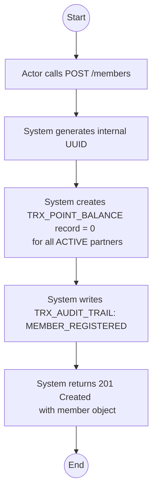
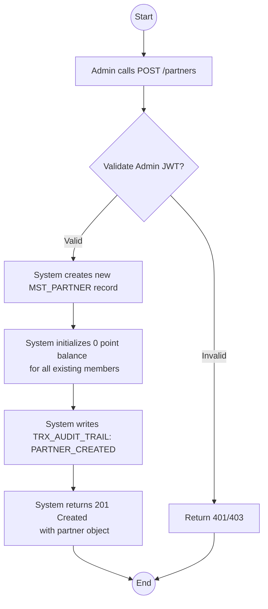
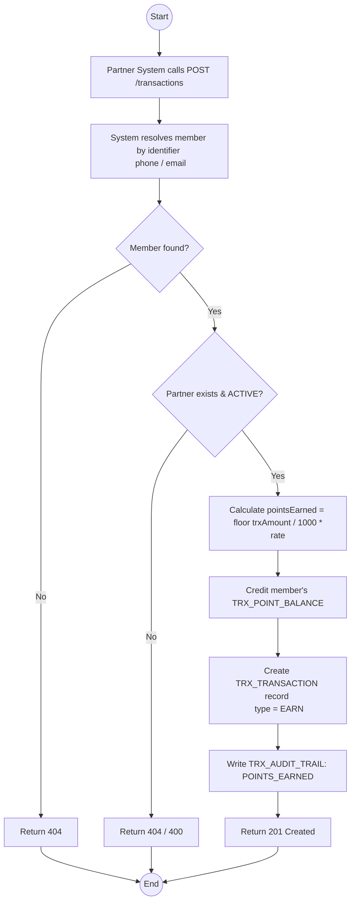
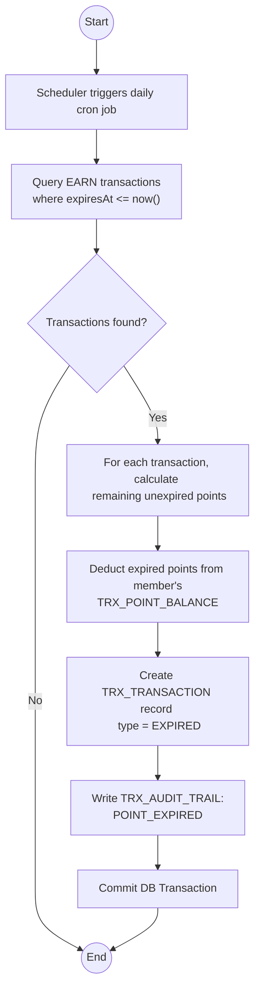
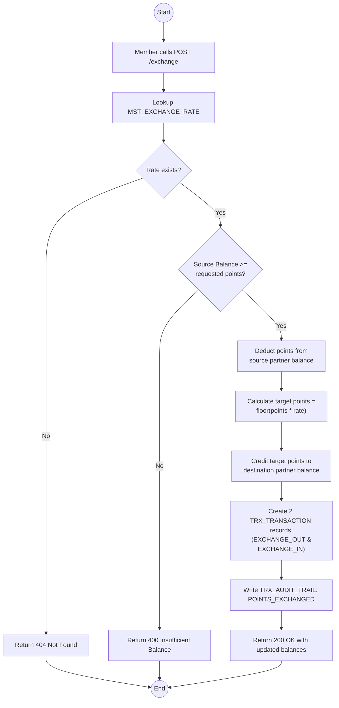

# Activity Diagrams

Dokumen ini berisi Activity Diagram untuk setiap fitur (Use Case) utama yang dijelaskan di dalam FSD.md dan TSD.md. Activity Diagram ini menggambarkan urutan langkah (alur) dari tiap proses bisnis.

## UC-01: Member Registration

---

## UC-02: Partner Master Management (Create Partner)

---

## UC-03: Point Accumulation

---

## UC-04: Point Expiry (Background Process)

---

## UC-05: Point Exchange Between Partners

