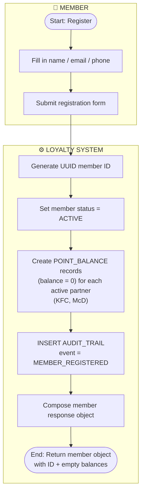
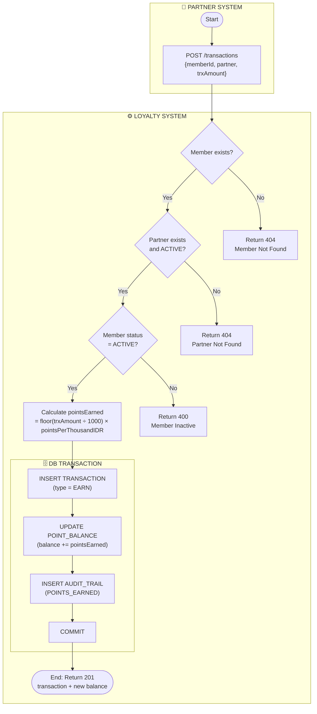
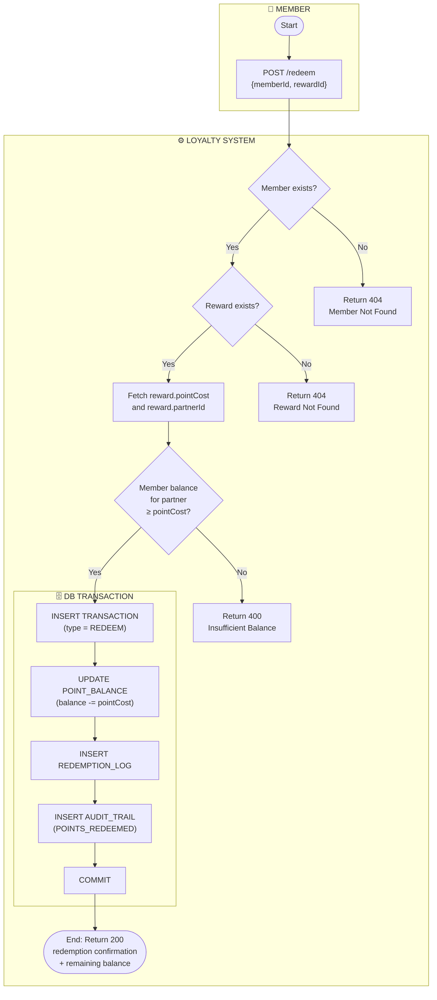
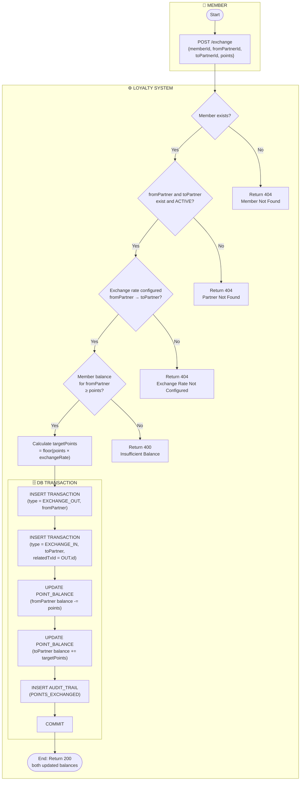

# JDT-17-LOYALTY — Process Flows (BPMN)

> Version: 1.0 · Date: 2026-07-02

---

## Notation Choice

These diagrams use **Mermaid `flowchart` syntax** (not BPMN XML) for Markdown portability — they render natively in GitHub, GitLab, Obsidian, and most modern documentation tools.

**Swimlanes** are approximated with Mermaid `subgraph` blocks, one block per actor. True BPMN pools/lanes are not supported in Mermaid, but the subgraph structure conveys the same actor-boundary intent.

For **true BPMN notation** (with formal events, gateways, pools, and lanes), these flows can be recreated in a BPMN-capable tool such as **Camunda Modeler**, **draw.io**, or **Bizagi** using the step sequences documented below. True BPMN would add:

| BPMN Element | Symbol | Mermaid Approximation |
|---|---|---|
| Start Event | Circle (thin border) | `([Start])` |
| End Event | Circle (thick border) | `([End])` |
| Exclusive Gateway | Diamond with **×** | `{Decision?}` |
| Service Task | Rectangle with ⚙ gear | `[Step]` |
| Pool / Lane | Horizontal band | `subgraph ACTOR` |

---

## Flow 1: Member Registration

**Actors:** Member · Loyalty System

---

## Flow 2: Point Accumulation

**Actors:** Partner System · Loyalty System

---

## Flow 3: Point Redemption

**Actors:** Member · Loyalty System

---

## Flow 4: Point Exchange

**Actors:** Member · Loyalty System

