# JDT-17-LOYALTY — Process Flows (BPMN Levels 0–3)

> Version: 3.0 · Date: 2026-07-02
> Description: Process models mapped across standard BPMN hierarchy levels (Level 0 to Level 3) for the Loyalty Points Platform.

---

## 📌 BPMN Modeling Levels Overview

To provide clear communication across different stakeholders (business executives, system analysts, and developers), this document structures the process flows into four distinct levels of detail:

*   **Level 0: Ecosystem Landscape (Value Chain)**
    *   *Audience:* Executive sponsors, business owners.
    *   *Purpose:* High-level context diagram showing core actors, integration boundaries, and overall flow of value.
*   **Level 1: Business Process Flow (Conceptual)**
    *   *Audience:* Business users, project managers.
    *   *Purpose:* Simplified "happy path" sequences of the core business scenarios without technical details or gateways.
*   **Level 2: Process Detail & Gateways (Analytical)**
    *   *Audience:* Business Analysts, QA testers.
    *   *Purpose:* End-to-end process maps with **swimlanes per actor**, decision points (gateways), validation rules, error handling, and alternative paths. Covers all core + supporting flows.
*   **Level 3: Technical Execution (Implementation)**
    *   *Audience:* Backend engineers, integration developers.
    *   *Purpose:* Low-level technical diagrams specifying API endpoints, database transaction boundaries (`BEGIN` and `COMMIT`), specific database updates, and exact HTTP response status codes.

---

## 🗺️ LEVEL 0: Ecosystem Landscape

This diagram depicts the high-level business environment, illustrating the relationship between the **Member**, the **CMS Admin**, the third-party **Partner Systems** (KFC/McDonald's), and the **Loyalty Platform Core**.

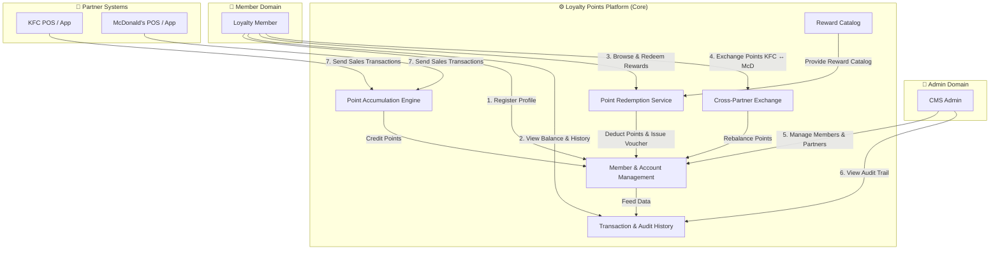

---

## 🏃 LEVEL 1: Business Process Flow (Conceptual)

These high-level, linear flows represent the conceptual steps for each core process, focusing strictly on the successful path.

### 1. Member Registration (Conceptual)
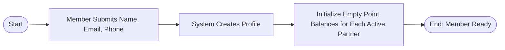

### 2. Point Accumulation (Conceptual)
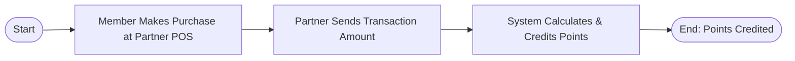

### 3. Point Redemption (Conceptual)
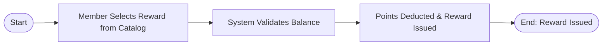

### 4. Point Exchange (Conceptual)
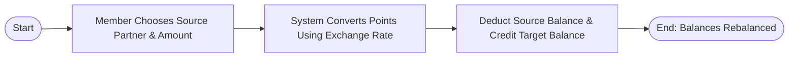

### 5. View Point Balance (Conceptual)
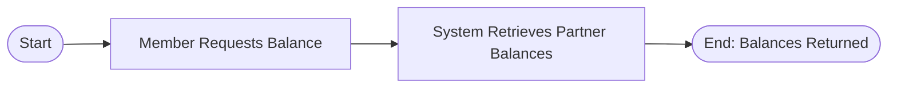

### 6. View Transaction History (Conceptual)
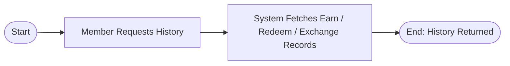

### 7. Member Status Update by Admin (Conceptual)
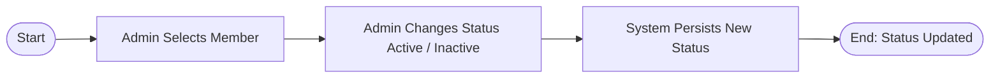

---

## 🔀 LEVEL 2: Process Detail & Gateways (Analytical)

These detailed workflows map out all actor swim-lanes, validation checkpoints, decision-making pathways, and business error scenarios for every core and supporting flow.

### Flow 1: Member Registration Detail
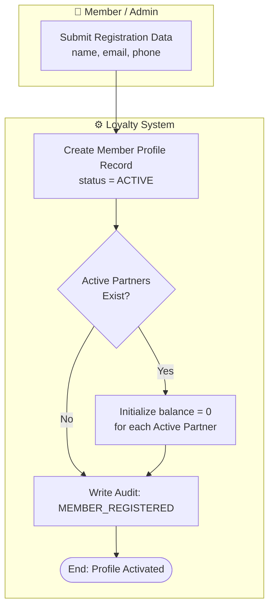

---

### Flow 2: Point Accumulation Detail
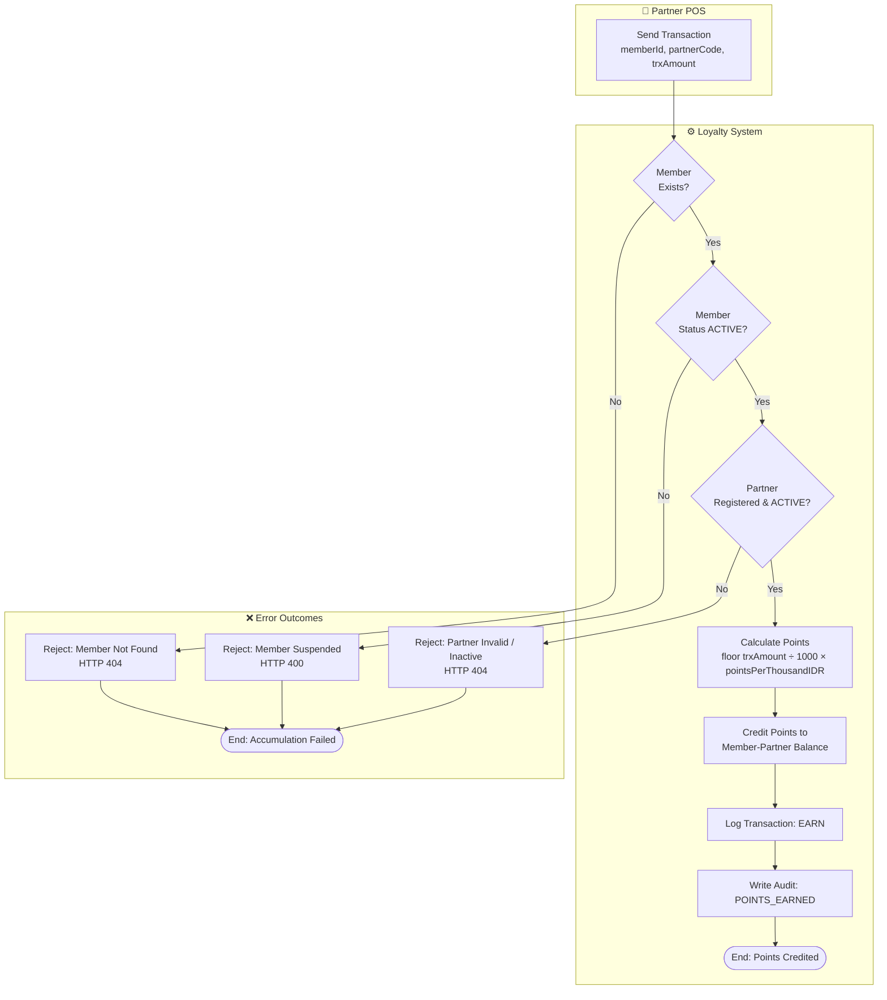

---

### Flow 3: Point Redemption Detail
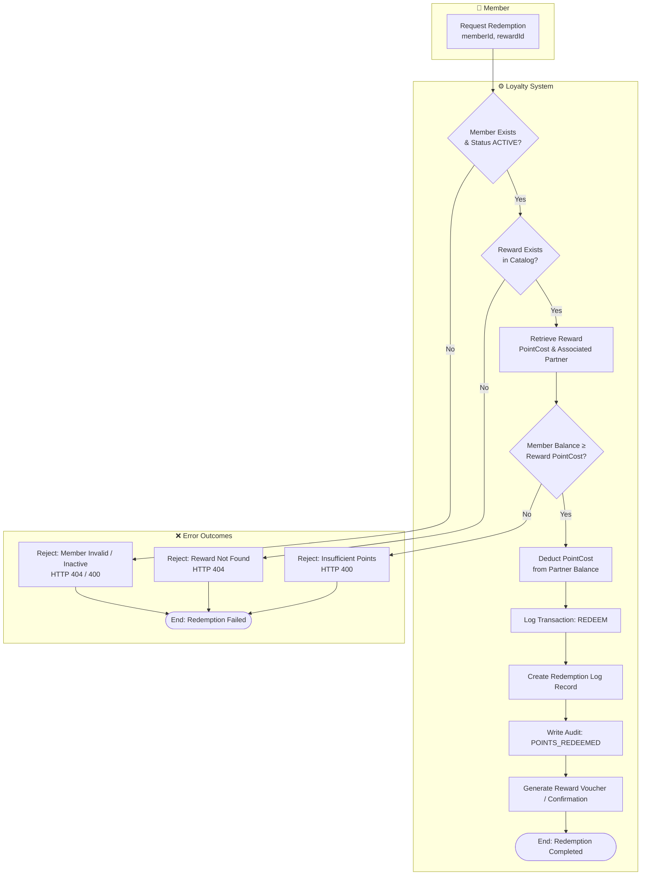

---

### Flow 4: Point Exchange Detail
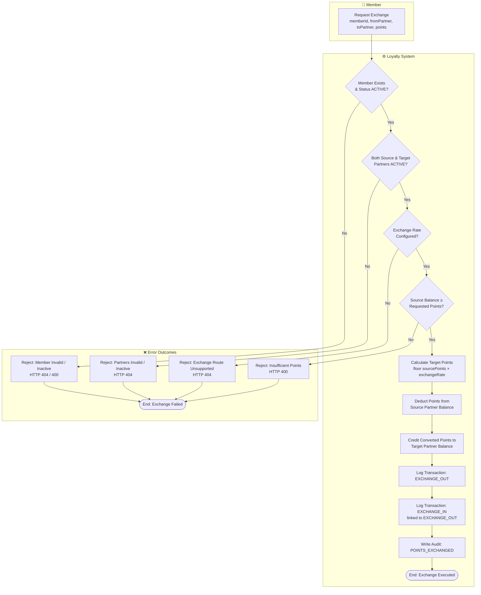

---

### Flow 5: View Point Balance Detail
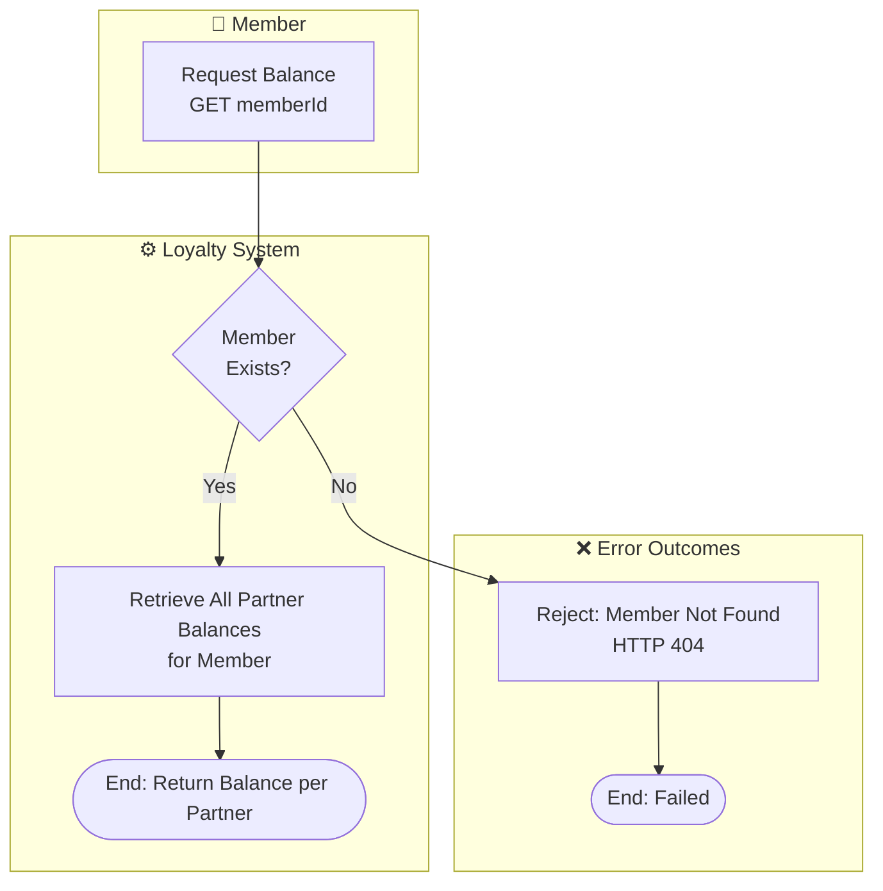

---

### Flow 6: View Transaction History Detail
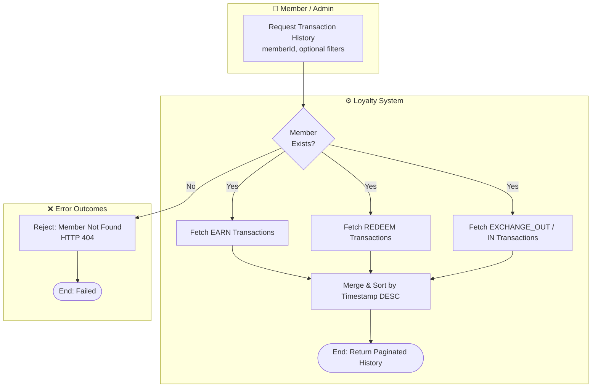

---

### Flow 7: Redemption History Detail
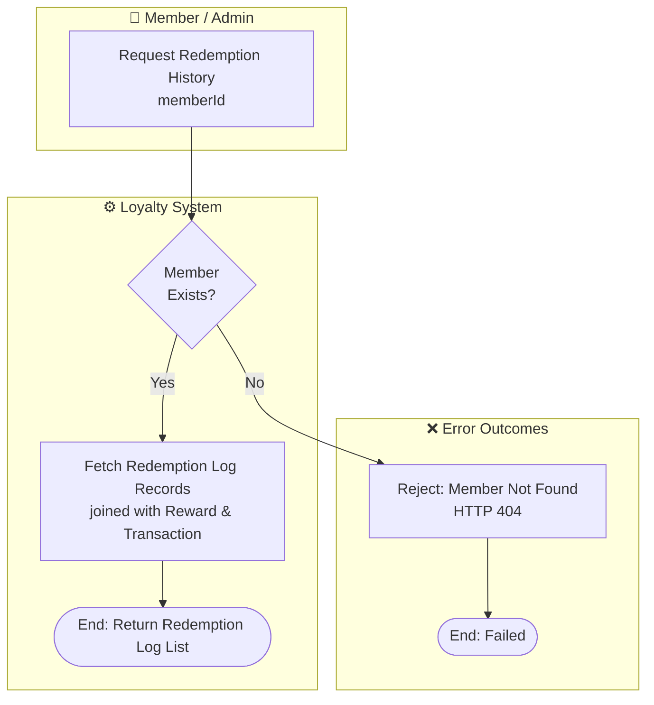

---

### Flow 8: Member Status Update by Admin Detail
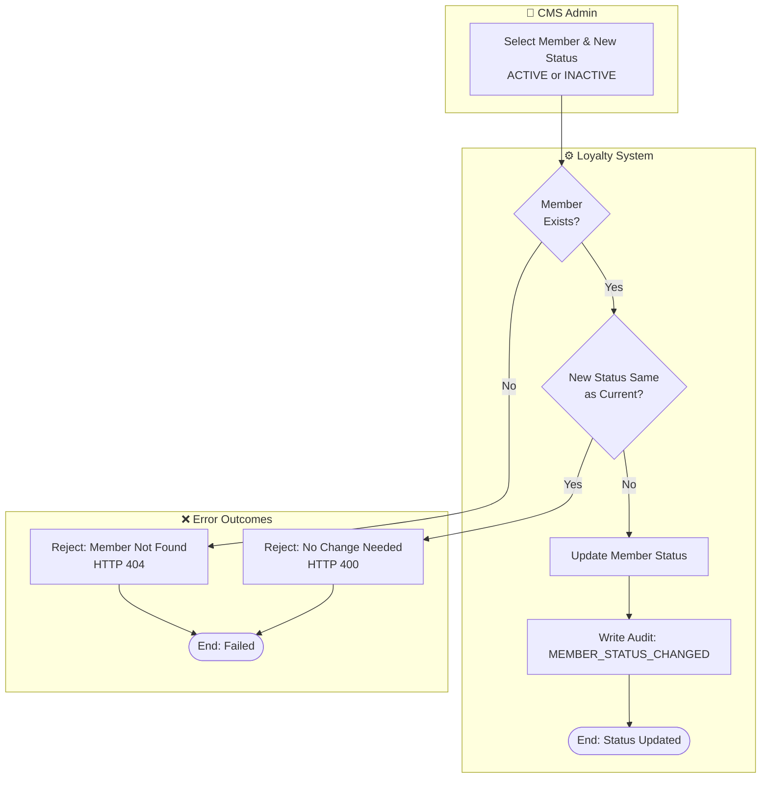

---

## ⚙️ LEVEL 3: Technical Execution (Implementation)

These diagrams describe the actual API layer, database transaction boundaries, data persistence details, and HTTP responses.

### Technical Flow 1: Member Registration (`POST /auth/register`)
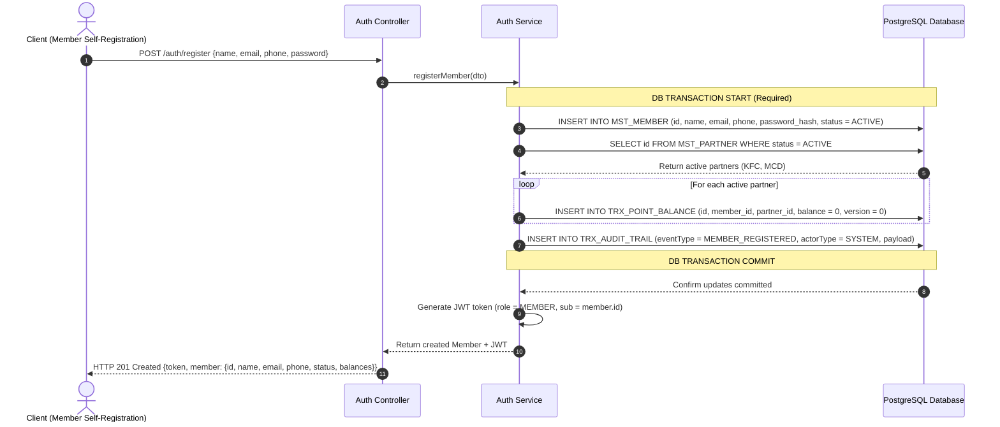

---

### Technical Flow 2: Point Accumulation (`POST /transactions`)
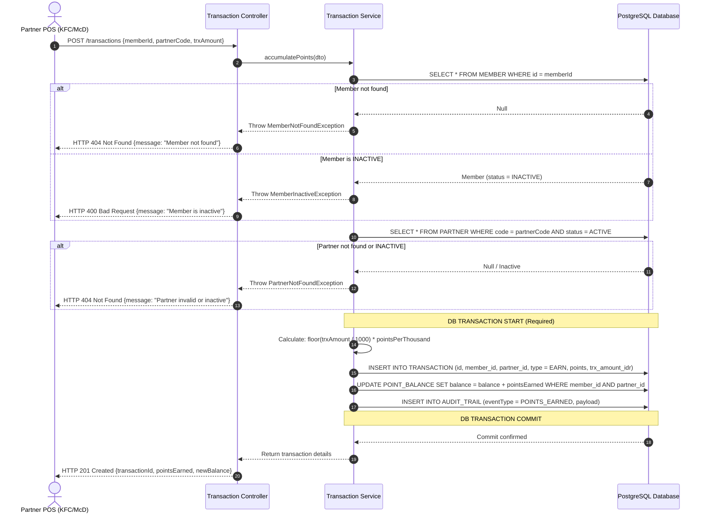

---

### Technical Flow 3: Point Redemption (`POST /redeem`)
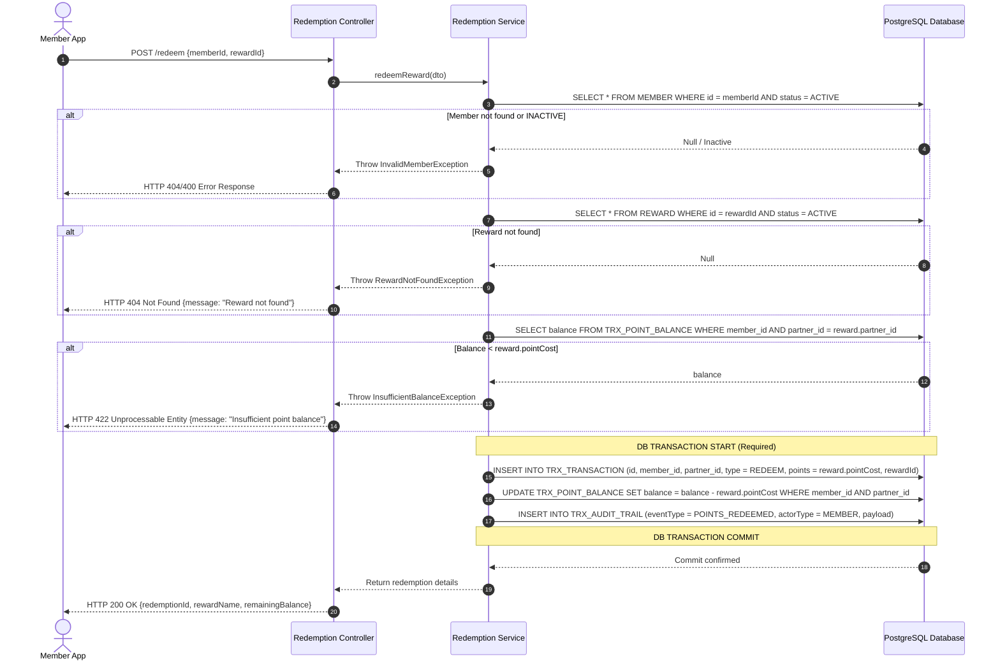

---

### Technical Flow 4: Point Exchange (`POST /exchange`)
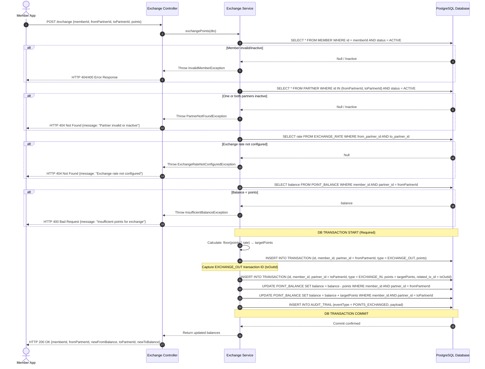

---

### Technical Flow 5: View Point Balance (`GET /members/{memberId}/balance`)
```mermaid
sequenceDiagram
    autonumber
    actor Member as Member App
    participant API as Member Controller
    participant Service as Member Service
    participant DB as PostgreSQL Database

    Member->>API: GET /members/{memberId}/balance
    API->>Service: getBalance(memberId)

    Service->>DB: SELECT * FROM MEMBER WHERE id = memberId
    alt Member not found
        DB-->>Service: Null
        Service-->>API: Throw MemberNotFoundException
        API-->>Member: HTTP 404 Not Found {message: "Member not found"}
    end

    Service->>DB: SELECT pb.partner_id, p.name, pb.balance FROM POINT_BALANCE pb JOIN PARTNER p ON pb.partner_id = p.id WHERE pb.member_id = memberId
    DB-->>Service: Return list of {partnerId, partnerName, balance}

    Service-->>API: Return balance list
    API-->>Member: HTTP 200 OK {memberId, balances: [{partnerId, partnerName, balance}]}
```

---

### Technical Flow 6: View Transaction History (`GET /members/{memberId}/transactions`)
```mermaid
sequenceDiagram
    autonumber
    actor Member as Member App
    participant API as Transaction Controller
    participant Service as Transaction Service
    participant DB as PostgreSQL Database

    Member->>API: GET /members/{memberId}/transactions
    API->>Service: getTransactionHistory(memberId)

    Service->>DB: SELECT * FROM MEMBER WHERE id = memberId
    alt Member not found
        DB-->>Service: Null
        Service-->>API: Throw MemberNotFoundException
        API-->>Member: HTTP 404 Not Found {message: "Member not found"}
    end

    Service->>DB: SELECT t.*, p.name AS partnerName FROM TRANSACTION t JOIN PARTNER p ON t.partner_id = p.id WHERE t.member_id = memberId ORDER BY created_at DESC
    DB-->>Service: Return transaction rows (EARN, REDEEM, EXCHANGE_OUT, EXCHANGE_IN)

    Service-->>API: Return paginated result
    API-->>Member: HTTP 200 OK {memberId, transactions: [{id, type, points, partnerName, createdAt, ...}]}
```

---

### Technical Flow 7: Member Status Update (`PATCH /members/{memberId}/status`)
```mermaid
sequenceDiagram
    autonumber
    actor Admin as CMS Admin
    participant API as Member Controller
    participant Service as Member Service
    participant DB as PostgreSQL Database

    Admin->>API: PATCH /members/{memberId}/status {status: "INACTIVE"}
    API->>Service: updateMemberStatus(memberId, newStatus)

    Service->>DB: SELECT * FROM MEMBER WHERE id = memberId
    alt Member not found
        DB-->>Service: Null
        Service-->>API: Throw MemberNotFoundException
        API-->>Admin: HTTP 404 Not Found {message: "Member not found"}
    end

    alt New status equals current status
        Service-->>API: Throw NoChangeException
        API-->>Admin: HTTP 400 Bad Request {message: "Status already set to requested value"}
    end

    Note over Service, DB: DB TRANSACTION START (Required)

    Service->>DB: UPDATE MEMBER SET status = newStatus WHERE id = memberId
    Service->>DB: INSERT INTO AUDIT_TRAIL (eventType = MEMBER_STATUS_CHANGED, payload: {memberId, oldStatus, newStatus})

    Note over Service, DB: DB TRANSACTION COMMIT
    DB-->>Service: Commit confirmed

    Service-->>API: Return updated member
    API-->>Admin: HTTP 200 OK {id, name, status}
```
