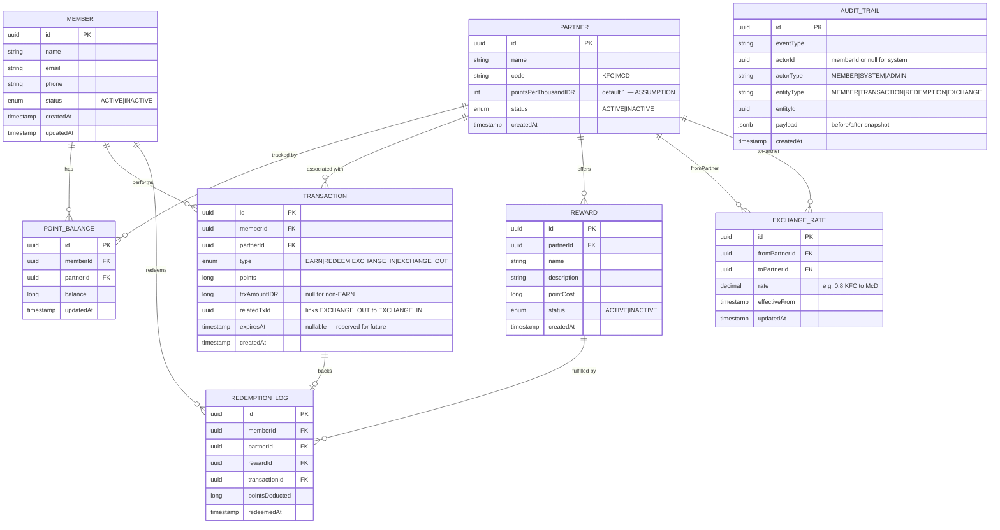

# JDT-17-LOYALTY — Entity Relationship Diagram

> **Platform:** Multi-partner loyalty system (KFC / McDonald's pilot)
> **Version:** 1.0 | **Date:** 2026-07-02
>
> This document is the authoritative data-model reference for the JDT-17-LOYALTY platform.
> It defines all persistent entities, their fields, and the relationships between them.
> The diagram is generated from the Technical Specification Document (TSD.md) and must remain
> in sync with the JPA entity classes in the codebase.

---

## Entity Relationship Diagram

---

## Key Design Decisions

- **UUID primary keys everywhere** — all entities use UUID PKs to support distributed ID generation without a central sequence, and to avoid exposing internal row counts through the API.
- **POINT_BALANCE is partner-scoped** — a member holds a separate balance per partner (`memberId + partnerId` unique pair), preventing cross-partner balance leakage while allowing a single member record to participate in multiple programmes.
- **TRANSACTION is the single source of truth for points movement** — every earn, redeem, exchange-in, and exchange-out is a TRANSACTION row; REDEMPTION_LOG is a projection / enrichment layer, not a replacement ledger.
- **EXCHANGE is modelled as a paired TRANSACTION** — an exchange produces two rows (`EXCHANGE_OUT` debiting the source partner balance, `EXCHANGE_IN` crediting the destination), linked via `relatedTxId` to allow atomic rollback and audit.
- **EXCHANGE_RATE is time-effective** — `effectiveFrom` enables scheduled rate changes without requiring a service restart; the application resolves the active rate at event time using `MAX(effectiveFrom) ≤ now`.
- **AUDIT_TRAIL is append-only and system-agnostic** — `actorType` distinguishes human members, admins, and automated system processes; `payload` (jsonb before/after snapshot) supports compliance reporting and rollback analysis without touching primary tables.

---

## Entity Reference

### MEMBER

| Field | Type | Constraints | Notes |
|-------|------|-------------|-------|
| id | uuid | PK, NOT NULL | Surrogate key; generated by application |
| name | string | NOT NULL | Full display name |
| email | string | NOT NULL, UNIQUE | Used for login and notifications |
| phone | string | NULLABLE | Optional contact number |
| status | enum | NOT NULL, DEFAULT `ACTIVE` | `ACTIVE` or `INACTIVE`; soft-delete mechanism |
| createdAt | timestamp | NOT NULL | UTC; set on insert |
| updatedAt | timestamp | NOT NULL | UTC; updated on every write |

---

### PARTNER

| Field | Type | Constraints | Notes |
|-------|------|-------------|-------|
| id | uuid | PK, NOT NULL | Surrogate key |
| name | string | NOT NULL | Human-readable partner name |
| code | string | NOT NULL, UNIQUE | Short code e.g. `KFC`, `MCD` |
| pointsPerThousandIDR | int | NOT NULL, DEFAULT 1 | Points awarded per IDR 1,000 spent — **ASSUMPTION** pending partner contract |
| status | enum | NOT NULL, DEFAULT `ACTIVE` | `ACTIVE` or `INACTIVE` |
| createdAt | timestamp | NOT NULL | UTC; set on insert |

---

### POINT_BALANCE

| Field | Type | Constraints | Notes |
|-------|------|-------------|-------|
| id | uuid | PK, NOT NULL | Surrogate key |
| memberId | uuid | FK → MEMBER.id, NOT NULL | Owning member |
| partnerId | uuid | FK → PARTNER.id, NOT NULL | Partner context for this balance shard |
| balance | long | NOT NULL, DEFAULT 0 | Current available points; must never go negative |
| updatedAt | timestamp | NOT NULL | UTC; updated on every points movement |

> **Unique constraint:** `(memberId, partnerId)` — one balance row per member-partner pair.

---

### TRANSACTION

| Field | Type | Constraints | Notes |
|-------|------|-------------|-------|
| id | uuid | PK, NOT NULL | Surrogate key |
| memberId | uuid | FK → MEMBER.id, NOT NULL | Member who initiated the transaction |
| partnerId | uuid | FK → PARTNER.id, NOT NULL | Partner context (source for EXCHANGE_OUT, destination for EXCHANGE_IN) |
| type | enum | NOT NULL | `EARN`, `REDEEM`, `EXCHANGE_IN`, `EXCHANGE_OUT` |
| points | long | NOT NULL | Absolute point amount (positive for all types; sign is implied by type) |
| trxAmountIDR | long | NULLABLE | Purchase amount in IDR; populated only for `EARN` type |
| relatedTxId | uuid | NULLABLE, FK → TRANSACTION.id | Links an `EXCHANGE_OUT` row to its paired `EXCHANGE_IN` row |
| expiresAt | timestamp | NULLABLE | Reserved for future point-expiry feature; not enforced in v1 |
| createdAt | timestamp | NOT NULL | UTC; immutable after insert |

---

### REDEMPTION_LOG

| Field | Type | Constraints | Notes |
|-------|------|-------------|-------|
| id | uuid | PK, NOT NULL | Surrogate key |
| memberId | uuid | FK → MEMBER.id, NOT NULL | Redeeming member |
| partnerId | uuid | FK → PARTNER.id, NOT NULL | Partner whose reward was redeemed |
| rewardId | uuid | FK → REWARD.id, NOT NULL | Reward that was fulfilled |
| transactionId | uuid | FK → TRANSACTION.id, NOT NULL | Backing `REDEEM` transaction row |
| pointsDeducted | long | NOT NULL | Points deducted at time of redemption (snapshot for immutability) |
| redeemedAt | timestamp | NOT NULL | UTC; set on insert |

---

### REWARD

| Field | Type | Constraints | Notes |
|-------|------|-------------|-------|
| id | uuid | PK, NOT NULL | Surrogate key |
| partnerId | uuid | FK → PARTNER.id, NOT NULL | Partner who owns this reward catalogue entry |
| name | string | NOT NULL | Display name shown to members |
| description | string | NULLABLE | Long-form description / T&C |
| pointCost | long | NOT NULL | Points required to redeem; must be > 0 |
| status | enum | NOT NULL, DEFAULT `ACTIVE` | `ACTIVE` or `INACTIVE`; soft-delete mechanism |
| createdAt | timestamp | NOT NULL | UTC; set on insert |

---

### EXCHANGE_RATE

| Field | Type | Constraints | Notes |
|-------|------|-------------|-------|
| id | uuid | PK, NOT NULL | Surrogate key |
| fromPartnerId | uuid | FK → PARTNER.id, NOT NULL | Source partner (points being converted from) |
| toPartnerId | uuid | FK → PARTNER.id, NOT NULL | Destination partner (points being converted to) |
| rate | decimal | NOT NULL | Multiplier applied to source points; e.g. `0.8` means 100 KFC pts → 80 MCD pts |
| effectiveFrom | timestamp | NOT NULL | UTC; active rate selected as `MAX(effectiveFrom) ≤ now` |
| updatedAt | timestamp | NOT NULL | UTC; updated on rate change |

> **Note:** `fromPartnerId ≠ toPartnerId` must be enforced at the application layer (or via CHECK constraint).

---

### AUDIT_TRAIL

| Field | Type | Constraints | Notes |
|-------|------|-------------|-------|
| id | uuid | PK, NOT NULL | Surrogate key |
| eventType | string | NOT NULL | Coarse event label e.g. `POINT_EARN`, `REDEMPTION_CREATED`, `EXCHANGE_EXECUTED` |
| actorId | uuid | NULLABLE | Member UUID, admin UUID, or `null` for system-initiated events |
| actorType | string | NOT NULL | `MEMBER`, `SYSTEM`, or `ADMIN` |
| entityType | string | NOT NULL | Affected domain object: `MEMBER`, `TRANSACTION`, `REDEMPTION`, or `EXCHANGE` |
| entityId | uuid | NOT NULL | PK of the affected entity row |
| payload | jsonb | NULLABLE | Before/after state snapshot for compliance and rollback analysis |
| createdAt | timestamp | NOT NULL | UTC; immutable; set on insert |

> **Append-only:** No UPDATE or DELETE operations are permitted on this table.
