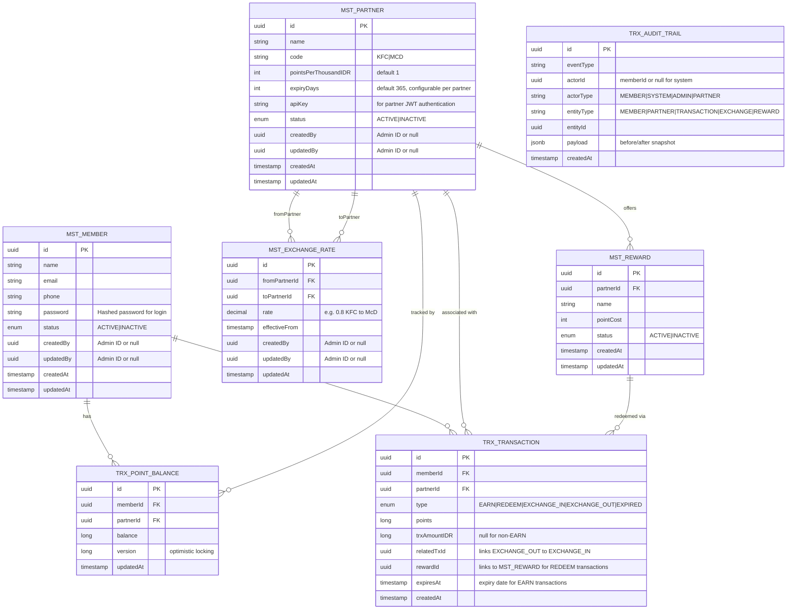

# JDT-17-LOYALTY — Entity Relationship Diagram

> **Platform:** Multi-partner loyalty system (KFC / McDonald's pilot)
> **Version:** 1.0 | **Date:** 2026-07-02
>
> This document is the authoritative data-model reference for the JDT-17-LOYALTY platform.
> It defines all persistent entities, their fields, and the relationships between them.
> The diagram is generated from the Technical Specification Document (TSD.md) and must remain
> in sync with the JPA entity classes in the codebase.

---

## Entity Relationship Diagram

---

## Key Design Decisions

- **UUID primary keys everywhere** — all entities use UUID PKs to support distributed ID generation without a central sequence, and to avoid exposing internal row counts through the API.
- **TRX_POINT_BALANCE is partner-scoped** — a member holds a separate balance per partner (`memberId + partnerId` unique pair), preventing cross-partner balance leakage while allowing a single member record to participate in multiple programmes.
- **TRX_POINT_BALANCE.version enables optimistic locking** — JPA `@Version` annotation prevents race conditions when concurrent transactions update the same balance. Spring automatically retries on `OptimisticLockException`.
- **TRX_TRANSACTION is the single source of truth for points movement** — every earn, redeem, exchange-in, exchange-out, and expiry is a TRX_TRANSACTION row. The `EXPIRED` type is recorded as its own transaction for member-visible history (members can see why balance decreased).
- **EXCHANGE is modelled as a paired TRX_TRANSACTION** — an exchange produces two rows (`EXCHANGE_OUT` debiting the source partner balance, `EXCHANGE_IN` crediting the destination), linked via `relatedTxId` to allow atomic rollback and audit.
- **REDEMPTION links to MST_REWARD** — `TRX_TRANSACTION.rewardId` foreign key connects REDEEM transactions to the specific reward item. No stock management in MVP (balance validation only).
- **EXCHANGE_RATE is time-effective** — `effectiveFrom` enables scheduled rate changes without requiring a service restart; the application resolves the active rate at event time using `MAX(effectiveFrom) ≤ now`.
- **Partner-configurable expiry** — `MST_PARTNER.expiryDays` sets expiry duration per partner (default 365). Expiry date computed at EARN time: `expiresAt = now + partner.expiryDays days`.
- **Partner JWT authentication** — `MST_PARTNER.apiKey` validated on `POST /auth/partner/token` to issue a partner-scoped JWT for API calls.
- **AUDIT_TRAIL is append-only and system-agnostic** — `actorType` distinguishes human members, admins, partners, and automated system processes; `payload` (jsonb before/after snapshot) supports compliance reporting and rollback analysis without touching primary tables.

---

## Entity Reference

### MST_MEMBER

| Field | Type | Constraints | Notes |
|-------|------|-------------|-------|
| id | uuid | PK, NOT NULL | Surrogate key; generated by application |
| name | string | NOT NULL | Full display name |
| email | string | NOT NULL, UNIQUE | Used for login and notifications |
| phone | string | NULLABLE | Optional contact number |
| password | string | NOT NULL | Hashed password for authentication |
| status | enum | NOT NULL, DEFAULT `ACTIVE` | `ACTIVE` or `INACTIVE`; soft-delete mechanism |
| createdBy | uuid | NULLABLE | Admin ID who created, or null |
| updatedBy | uuid | NULLABLE | Admin ID who last updated |
| createdAt | timestamp | NOT NULL | UTC; set on insert |
| updatedAt | timestamp | NOT NULL | UTC; updated on every write |

---

### MST_PARTNER

| Field | Type | Constraints | Notes |
|-------|------|-------------|-------|
| id | uuid | PK, NOT NULL | Surrogate key |
| name | string | NOT NULL | Human-readable partner name |
| code | string | NOT NULL, UNIQUE | Short code e.g. `KFC`, `MCD` |
| pointsPerThousandIDR | int | NOT NULL, DEFAULT 1 | Points awarded per IDR 1,000 spent |
| expiryDays | int | NOT NULL, DEFAULT 365 | Configurable expiry duration per partner; expiresAt computed at EARN time |
| apiKey | string | NULLABLE | Validated on POST /auth/partner/token for partner JWT authentication |
| status | enum | NOT NULL, DEFAULT `ACTIVE` | `ACTIVE` or `INACTIVE` |
| createdBy | uuid | NULLABLE | Admin ID who created |
| updatedBy | uuid | NULLABLE | Admin ID who last updated |
| createdAt | timestamp | NOT NULL | UTC; set on insert |
| updatedAt | timestamp | NOT NULL | UTC; updated on every write |

---

### TRX_POINT_BALANCE

| Field | Type | Constraints | Notes |
|-------|------|-------------|-------|
| id | uuid | PK, NOT NULL | Surrogate key |
| memberId | uuid | FK → MST_MEMBER.id, NOT NULL | Owning member |
| partnerId | uuid | FK → MST_PARTNER.id, NOT NULL | Partner context for this balance shard |
| balance | long | NOT NULL, DEFAULT 0 | Current available points; must never go negative |
| updatedAt | timestamp | NOT NULL | UTC; updated on every points movement |

> **Unique constraint:** `(memberId, partnerId)` — one balance row per member-partner pair.

---

### TRX_TRANSACTION

| Field | Type | Constraints | Notes |
|-------|------|-------------|-------|
| id | uuid | PK, NOT NULL | Surrogate key |
| memberId | uuid | FK → MST_MEMBER.id, NOT NULL | Member who initiated the transaction |
| partnerId | uuid | FK → MST_PARTNER.id, NOT NULL | Partner context (source for EXCHANGE_OUT, destination for EXCHANGE_IN) |
| type | enum | NOT NULL | `EARN`, `EXCHANGE_IN`, `EXCHANGE_OUT`, `EXPIRED` |
| points | long | NOT NULL | Absolute point amount (positive for all types; sign is implied by type) |
| trxAmountIDR | long | NULLABLE | Purchase amount in IDR; populated only for `EARN` type |
| relatedTxId | uuid | NULLABLE, FK → TRX_TRANSACTION.id | Links an `EXCHANGE_OUT` row to its paired `EXCHANGE_IN` row |
| expiresAt | timestamp | NULLABLE | Point expiry date, applicable for `EARN` transactions |
| createdAt | timestamp | NOT NULL | UTC; immutable after insert |

---

### MST_EXCHANGE_RATE

| Field | Type | Constraints | Notes |
|-------|------|-------------|-------|
| id | uuid | PK, NOT NULL | Surrogate key |
| fromPartnerId | uuid | FK → MST_PARTNER.id, NOT NULL | Source partner (points being converted from) |
| toPartnerId | uuid | FK → MST_PARTNER.id, NOT NULL | Destination partner (points being converted to) |
| rate | decimal | NOT NULL | Multiplier applied to source points; e.g. `0.8` means 100 KFC pts → 80 MCD pts |
| effectiveFrom | timestamp | NOT NULL | UTC; active rate selected as `MAX(effectiveFrom) ≤ now` |
| createdBy | uuid | NULLABLE | Admin ID who created |
| updatedBy | uuid | NULLABLE | Admin ID who last updated |
| updatedAt | timestamp | NOT NULL | UTC; updated on rate change |

> **Note:** `fromPartnerId ≠ toPartnerId` must be enforced at the application layer (or via CHECK constraint).

---

### TRX_AUDIT_TRAIL

| Field | Type | Constraints | Notes |
|-------|------|-------------|-------|
| id | uuid | PK, NOT NULL | Surrogate key |
| eventType | string | NOT NULL | Coarse event label e.g. `POINT_EARN`, `EXCHANGE_EXECUTED`, `POINT_EXPIRED`, `PARTNER_CREATED` |
| actorId | uuid | NULLABLE | Member UUID, admin UUID, or `null` for system-initiated events |
| actorType | string | NOT NULL | `MEMBER`, `SYSTEM`, or `ADMIN` |
| entityType | string | NOT NULL | Affected domain object: `MEMBER`, `PARTNER`, `TRANSACTION`, or `EXCHANGE` |
| entityId | uuid | NOT NULL | PK of the affected entity row |
| payload | jsonb | NULLABLE | Before/after state snapshot for compliance and rollback analysis |
| createdAt | timestamp | NOT NULL | UTC; immutable; set on insert |

> **Append-only:** No UPDATE or DELETE operations are permitted on this table.
