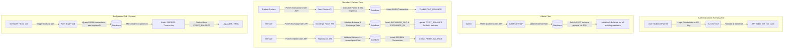

# High Level Flow Process

```mermaid
graph TD
    subgraph "Authentication & Authorization"
        A1[User / Admin / Partner] -->|Login Credentials or API Key| A2(Auth Service)
        A2 -->|Validate & Generate| A3[JWT Token with role claim]
    end

    subgraph "Admin Flow"
        B1[Admin] -->|POST /partners with JWT| B2(Add Partner API)
        B2 -->|Validate Admin Role| B3[(Database)]
        B3 -->|Bulk INSERT balance records via SQL| B4[Initialize 0 Balance for all existing members]
    end

    subgraph "Member / Partner Flow"
        C1[Partner System] -->|POST /transactions with JWT| C2(Earn Points API)
        C2 -->|Calculate Points & Set expiresAt| C3[(Database)]
        C3 -->|Insert EARN Transaction| C4[Credit POINT_BALANCE]

        C5[Member] -->|POST /exchange with JWT| C6(Exchange Points API)
        C6 -->|Validate Balance & Exchange Rate| C7[(Database)]
        C7 -->|Insert EXCHANGE_OUT & EXCHANGE_IN| C8[Update POINT_BALANCE for both partners]

        C9[Member] -->|POST /redeem with JWT| C10(Redemption API)
        C10 -->|Validate Balance >= reward.pointCost| C11[(Database)]
        C11 -->|Insert REDEEM Transaction| C12[Deduct POINT_BALANCE]
    end

    subgraph "Background Job (System)"
        D1[Scheduler / Cron Job] -->|Trigger Daily at 1am| D2(Point Expiry Job)
        D2 -->|Query EARN transactions past expiresAt| D3[(Database)]
        D3 -->|Mark original tx points=0| D4[Insert EXPIRED Transaction]
        D4 -->|Deduct from POINT_BALANCE| D5[Log AUDIT_TRAIL]
    end
```
