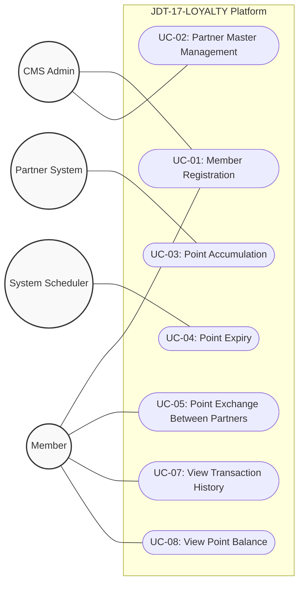

# Use Case Diagram

Diagram Use Case ini merepresentasikan aktor-aktor yang berinteraksi dengan platform JDT-17-LOYALTY beserta Use Case apa saja yang dapat mereka lakukan, sesuai dengan Functional Specification Document (FSD).

